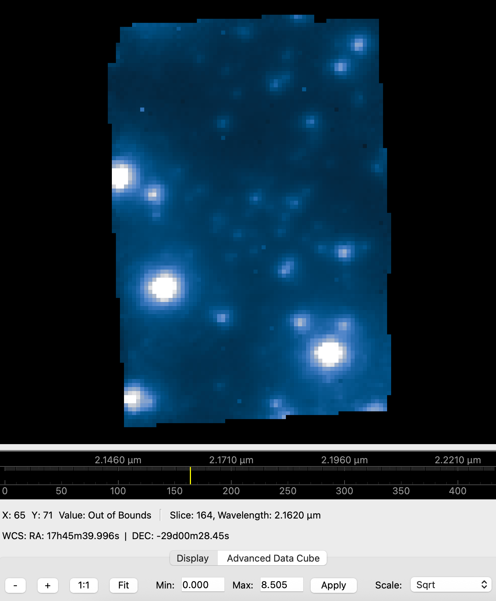
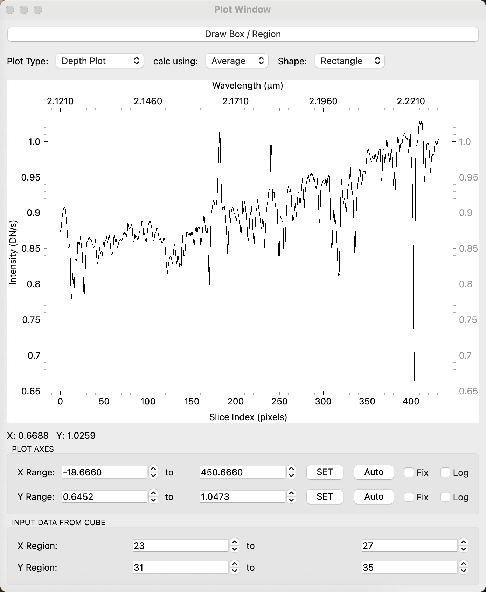

# QuickLook 3

QuickLook 3 is a modern, high-performance Python/Qt-based application designed for viewing integral field spectroscopy data. It provides a comprehensive graphical interface to interactively visualize both 2D images and 3D data cubes. This tool is a replacement for the legacy IDL `qlook2` GUI for viewing and analyzing FITS data originally built for the OSIRIS instrument at the Keck Observatory. While QuickLook 3 is optimized for OSIRIS data, it should work for most IFU instruments including JWST NIRSpec IFU and Gemini NIFS. 

<p float="left">
  
  
</p>

## Features

- **High-Performance Rendering**: Built on PySide6 and pyqtgraph for efficient, hardware-accelerated visualization of large FITS data cubes.
- **IFU Data Cube Visualization**: View FITS cubes with an interactively. Extract depth spectra from specific spatial pixels.
- **Z-Axis Collapsing**: Collapse 3D ranges into 2D display slices using Median, Mean, or Sum algorithms on the fly.
- **Advanced Scaling & Displays**: Includes interactive Linear, Logarithmic, Square Root, AsinH, and Histogram Equalization scaling. Supports instant color map inversion and position angle compass overlays.
- **Astronomical Coordinates**: Integrates WCS pixel-to-world (RA/Dec) coordinate translations at your mouse pointer. 
- **Array Transformations**: Rotate and flip the data array for visual alignment while preserving spatial coordinate integrity.
- **Analysis Tools**: Features built-in region cuts (horizontal, vertical, arbitrary lines), SNR estimates, Encircled Energy plots, 2D Peak Fitting, and Catalog Plotting.
- **Live File Polling**: Monitor a directory for incoming data files and automatically load them in real-time.
- **Header Editor**: View and modify FITS header cards directly in the UI.

## Installation

PyQL3 manages its dependencies seamlessly using `uv`, an extremely fast Python package and project manager. `uv` will automatically download the correct Python version and all required libraries (`PySide6`, `pyqtgraph`, `astropy`, `scipy`, etc.) so you don't have to worry about complex virtual environments.

### 1. Install `uv`

**For macOS and Linux:**
```bash
curl -LsSf https://astral.sh/uv/install.sh | sh
```

**For Windows:**
Open PowerShell and run:
```powershell
powershell -ExecutionPolicy ByPass -c "irm https://astral.sh/uv/install.ps1 | iex"
```

### 2. Launch PyQL3

Clone or navigate to the `pyql3` repository in your terminal/command prompt:
```bash
cd pyql3
```

Run the application through `uv`. It will automatically fetch dependencies and launch the GUI:
```bash
uv run python main.py
```

## Usage

### Building a Standalone Application

### macOS
You can compile PyQL3 into a standalone application that does not require users to install Python or any dependencies:

```bash
./build_app.sh
```

This will create `QuickLook3.app` in the `dist/` directory, along with a `.dmg` package containing the executable for your architecture (Intel or Apple Silicon).

### Windows
You can compile PyQL3 into a standalone `.exe` application bundle on Windows:

```cmd
build_app.bat
```

This will create a `QuickLook3` folder inside the `dist\` directory containing the main executable.

### Launching the Application
You can launch QuickLook 3 directly from the terminal. 

```bash
uv run python main.py
```
You can also pass a FITS file path as an argument to open it directly upon launch:
```bash
uv run python main.py /path/to/your/file.fits
```

### Basic Navigation
* **Open File**: `File -> Open File`
* **Polling**: `File -> Poll Directory` to auto-load new FITS files arriving in a specific folder.
* **Header**: `File -> View/Edit Header`

### Visual Controls
* **Slices & Slabs**: The bottom control panel allows you to switch between viewing a single Z-slice or a collapsed Z-range of a 3D datacube. Use the slider to navigate through the cube depth.
* **Scaling**: Adjust scaling limits dynamically using the intensity histogram gradient on the right side of the image, or select scaling algorithms (Logarithmic, Negative, etc.) via the `Display -> Scaling` menu or the bottom left dropdown menu.
* **Rotation**: `Display -> Rotate Image...` lets you orient the image properly.
* **Data Units**: Toggle between native `As DN/s` and Total DN (`As Total DN`) through the `Display` menu.

### Analysis Tools
Found under the **Plot** menu bar:
* **Horizontal/Vertical/Any Cut**: Draw lines or drag crosshairs across the image to generate 1D profile cuts. The cut tools support variable thickness for boxcar averaging.
* **Depth**: Click anywhere on a 3D dataset to plot the 1D spectrum along the Z-axis.
* **Peak Fit / Encircle / SNR**: Draw a rectangular ROI over a source to calculate 2D Gaussian statistics, Encircled Energy radial profiles, or Signal-to-Noise. 
* **Surface Plot**: Pop out a 3D OpenGL topographical surface render of the image data.
* **Catalog Plot**: Load standard CSV, TXT catalog files and overlay sources onto the FITS image. Features intelligent coordinate parsing (Display Pixels, FITS Pixels, or WCS RA/Dec), real-time search filtering, extensive marker styling, and context menus for coordinate extraction and centering.

## License

QuickLook 3 is licensed under the [BSD 3-Clause License](LICENSE). You are free to use, modify, and redistribute this software, provided that the original copyright notice and license text are retained.

## Authors
Tuan Do (UCLA)

Based on QuickLook 2 (ql2) for IDL from the OSIRIS Data Reduction Pipeline. See the contributors of the OSIRIS DRP here: https://github.com/Keck-DataReductionPipelines/OsirisDRP#alphabetical-list-of-contributors