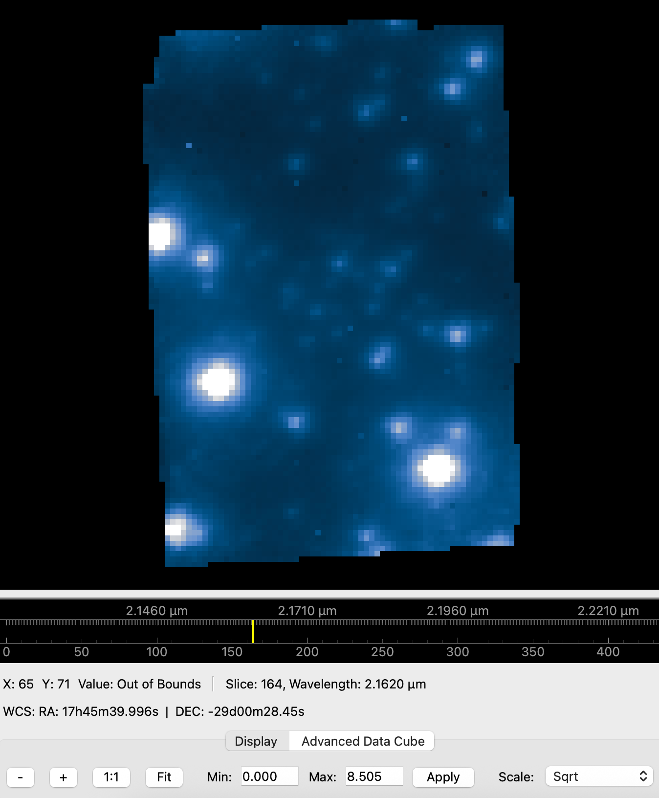
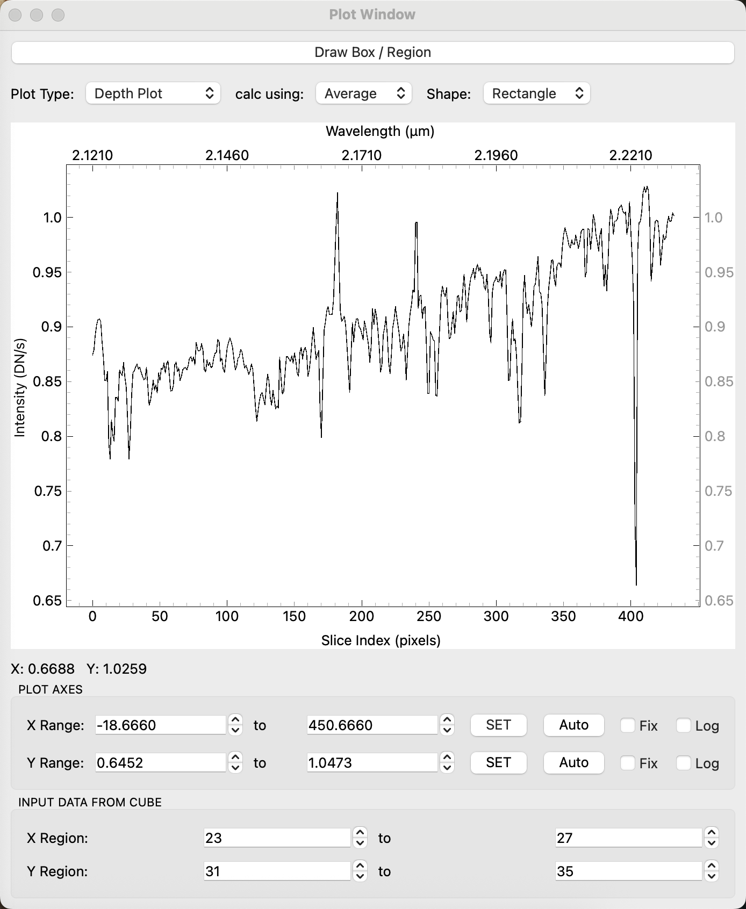

# QuickLook 3

QuickLook 3 is a modern, high-performance Python/Qt-based application designed for viewing integral field spectroscopy data. It provides a comprehensive graphical interface to interactively visualize both 2D images and 3D data cubes. This tool is a replacement for the legacy IDL `qlook2` GUI for viewing and analyzing FITS data originally built for the OSIRIS instrument at the Keck Observatory. While QuickLook 3 is optimized for OSIRIS data, it should work for most IFU instruments including JWST NIRSpec IFU and Gemini NIFS. 

<p float="left">
  
  
</p>

## Features

- **High-Performance Rendering**: Built on PySide6 and pyqtgraph for efficient, hardware-accelerated visualization of large FITS data cubes.
- **IFU Data Cube Visualization**: Interactively view FITS cubes across spatial and spectral dimensions. Extract 1D depth spectra from specific spatial pixels or regions.
- **Z-Axis Collapsing**: Collapse 3D spectral ranges into 2D display slices using Median, Mean, or Sum algorithms on the fly.
- **Advanced Scaling & Displays**: Includes interactive Linear, Logarithmic, Square Root, AsinH, and Histogram Equalization scaling. Supports instant color map inversion and position angle compass overlays.
- **Astronomical Coordinates & WCS**: Integrates WCS pixel-to-world (RA/Dec) coordinate translations dynamically at your mouse pointer.
- **Interactive Catalog Overlay**: Overlay astronomical catalogs (CSV, TXT, DAT, or FITS binary tables) using Display Pixels, FITS Pixels, or WCS RA/Dec coordinates. Features viewport label culling for fast performance, custom marker styling, search filtering, and row selection highlighting.
- **Analysis Tools**: Built-in 1D profile cuts (horizontal, vertical, arbitrary lines), SNR estimates, Encircled Energy plots, 2D Peak Fitting, and 3D OpenGL Surface Rendering.
- **FITS Datacube Arithmetic**: Execute image and cube math (addition, subtraction, division, scalar scaling) between open datasets.
- **Live File Polling**: Monitor a directory for incoming FITS files and automatically load them in real time as observations complete.
- **Header Editor**: View and modify FITS header cards directly in the UI.

## Download

Binaries of the applications are available for Linux, MacOS, and Windows. Download the latest release at [https://github.com/astrodatalab/pyql3/releases/latest](https://github.com/astrodatalab/pyql3/releases/latest)

### Verifying your download

The bundles are **not code-signed or notarized**, so your operating system cannot vouch for
them and you will have to bypass Gatekeeper or SmartScreen to run them. Every release
therefore publishes a `SHA256SUMS.txt` generated during the build. Download it alongside
the binary and check that the hash matches:

```bash
# macOS
shasum -a 256 -c SHA256SUMS.txt --ignore-missing

# Linux
sha256sum -c SHA256SUMS.txt --ignore-missing
```

```powershell
# Windows PowerShell — compare against the matching line in SHA256SUMS.txt
Get-FileHash .\QuickLook3-*-Windows.zip -Algorithm SHA256
```

A mismatch means the file was corrupted in transit or tampered with; do not run it.

## Installation

PyQL3 manages its dependencies seamlessly using `uv`, an extremely fast Python package and project manager. `uv` will automatically download the correct Python version and all required libraries (`PySide6`, `pyqtgraph`, `astropy`, `scipy`, etc.) so you don't have to worry about complex virtual environments.

### 1. Install `uv`

**For macOS and Linux:**
```bash
curl -LsSf https://astral.sh/uv/install.sh | sh
```

**For Windows:**
Open PowerShell and run:
```powershell
powershell -ExecutionPolicy ByPass -c "irm https://astral.sh/uv/install.ps1 | iex"
```

### 2. Launch PyQL3

Clone or navigate to the `pyql3` repository in your terminal/command prompt:
```bash
cd pyql3
```

Run the application through `uv`. It will automatically fetch dependencies and launch the GUI:
```bash
uv run python main.py
```

### 3. Optional: a `quicklook3` command, like `ds9`

To open FITS files from any directory with one word, install a launcher on your `PATH` — from
the menu bar (**Help ➔ Install 'quicklook3' Command Line Tool...**) or from a terminal:

```bash
uv run python main.py --install-cli     # source checkout
/Applications/QuickLook3.app/Contents/MacOS/QuickLook3 --install-cli   # installed macOS bundle
/opt/QuickLook3/QuickLook3 --install-cli                              # unpacked Linux build

quicklook3 cube.fits --collapse-range 100 200
```

The menu action shows exactly which file it will create, what that file will run, how to run
the command afterwards, and how to remove it — and installs nothing until you click
**Install**. The `--install-cli` flag treats itself as the confirmation and prints the same
summary after installing.

It installs into `/usr/local/bin` when writable, otherwise `~/.local/bin`, and gives you the
`export PATH=...` line if that directory is not already on your `PATH`. To uninstall, delete
the file (`rm ~/.local/bin/quicklook3`); nothing else is written. macOS and Linux only.

On macOS, open a freshly downloaded `QuickLook3.app` from Finder once (or run
`xattr -cr /Applications/QuickLook3.app`) before using `quicklook3`: macOS kills a quarantined app
started from a shell without printing anything. The installed launcher detects this and tells
you the fix. The macOS bundle also registers as a viewer for `.fits`, `.fit`, `.fts` and
`.fz`, so it appears in Finder's **Open With** menu and accepts files dropped on its icon.

## Usage

### Building a Standalone Application

### macOS
You can compile PyQL3 into a standalone application that does not require users to install Python or any dependencies:

```bash
./build_app.sh
```

This will create `QuickLook3.app` in the `dist/` directory, along with a `.dmg` package containing the executable for your architecture (Intel or Apple Silicon).

### Windows
You can compile PyQL3 into a standalone `.exe` application bundle on Windows:

```cmd
build_app.bat
```

This will create a `QuickLook3` folder inside the `dist\` directory containing the main executable.

### Launching the Application
You can launch QuickLook 3 directly from the terminal with flexible command-line options:

```bash
# Basic launch
uv run python main.py

# Open a FITS image or 3D cube directly
uv run python main.py /path/to/data.fits

# Open image and automatically load a target source catalog
uv run python main.py /path/to/data.fits --catalog /path/to/catalog.csv

# ... or a FITS table, optionally naming the extension to read
uv run python main.py /path/to/data.fits --catalog /path/to/catalog.fits --catalog-hdu SOURCES

# Auto-poll a directory for new incoming FITS files
uv run python main.py --poll-dir /path/to/raw_data/

# Start with a collapsed spectral slice range
uv run python main.py datacube.fits --collapse-range 100 200
```

### Basic Navigation
* **Open File**: `File -> Open File`
* **Polling**: `File -> Poll Directory` to auto-load new FITS files arriving in a specific folder.
* **Header**: `File -> View/Edit Header` to inspect or modify header keywords.
* **Window Manager**: `Window` menu bar collects all open tool dialogs, allowing you to select any window or click **Bring All to Front**.

### Visual Controls
* **Slices & Slabs**: The bottom control panel allows you to switch between viewing a single Z-slice or a collapsed Z-range of a 3D datacube. Use the slider to navigate through cube depth.
* **Scaling**: Adjust scaling limits dynamically using the intensity histogram gradient on the right side of the image, or select scaling algorithms (Linear, Logarithmic, Square Root, AsinH, Negative, Histogram Equalization) via the `Display -> Scaling` menu or bottom left dropdown.
* **Rotation & Flips**: `Display -> Rotate Image...` lets you orient the image properly while preserving spatial coordinate accuracy.
* **Data Units**: Toggle between native `As DN/s` and Total DN (`As Total DN`) through the `Display` menu.
* **Position Angle (PA)**: Enable `Display -> Position Angle` to display dynamic North/East compass rose vectors.

### Analysis & Catalog Tools
Found under the **Plot** and **Analysis** menu bars:
* **Catalog Plot Tool (`Plot -> Plot Catalog...`)**: Load astronomical catalog files (`.csv`, `.txt`, `.dat`) or FITS tables (`.fits`, `.fit`, `.fts`, gzipped) and overlay sources onto the FITS display.
  - **Coordinates**: Supports Display Pixels, FITS Pixels, or WCS RA/Dec (HMS/DMS or decimal degrees).
  - **FITS Tables**: Reads binary and ASCII table extensions; you are asked which extension to use when a file holds more than one. Common photutils / SExtractor column names (`xcentroid`, `X_IMAGE`, `ALPHA_J2000`, ...) are auto-detected, masked and undefined coordinates are skipped rather than plotted at the origin, and per-row vector columns (e.g. spectra) are omitted from the table.
  - **High Performance**: Features debounced hide-on-pan text label rendering for smooth 60 FPS panning even with thousands of catalog sources.
  - **Interactivity**: Filter table rows in real time with the built-in search bar, click rows to center sources on the image with a red highlight, or right-click rows to copy coordinates.
  - **CLI Auto-Load**: Pass `--catalog <file>` on launch to auto-open the tool and load the catalog, with `--catalog-hdu <index|EXTNAME>` to pick a FITS table extension.
* **1D Profile Cuts**: `Plot -> Horizontal / Vertical / Any Cut` to generate 1D profile cuts with adjustable boxcar averaging.
* **Depth Plot**: Click anywhere on a 3D dataset to extract and display 1D spectra along the Z-axis.
* **Peak Fit / Encircle / SNR**: Draw a rectangular ROI over a source to calculate 2D Gaussian statistics, Encircled Energy radial profiles, or Signal-to-Noise.
* **Surface Plot**: `Plot -> Surface Plot` renders a 3D OpenGL topographical surface mesh of the image data.
* **FITS Arithmetic**: `Analysis -> Arithmetic` performs addition, subtraction, division, and scalar scaling between open FITS datasets.

## License

QuickLook 3 is licensed under the [BSD 3-Clause License](LICENSE). You are free to use, modify, and redistribute this software, provided that the original copyright notice and license text are retained.

## Authors
Tuan Do (UCLA)

Based on QuickLook 2 (ql2) for IDL from the OSIRIS Data Reduction Pipeline. See the contributors of the OSIRIS DRP here: https://github.com/Keck-DataReductionPipelines/OsirisDRP#alphabetical-list-of-contributors