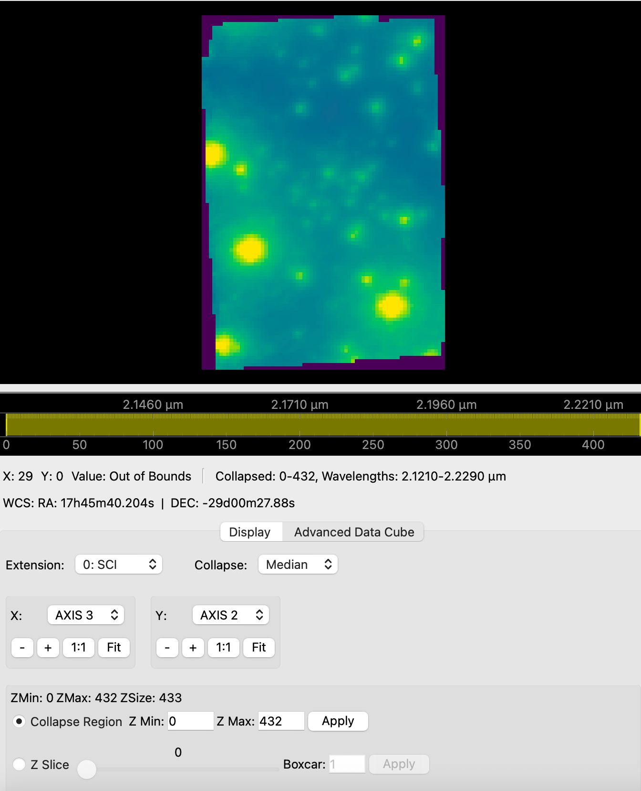

# QuickLook 3

Welcome to the documentation for **QuickLook 3**—a modern, high-performance Python/Qt-based application designed for viewing integral field spectroscopy (IFU) data.

This tool is a replacement for the legacy IDL `qlook2` GUI for viewing and analyzing FITS data originally built for the OSIRIS instrument at the Keck Observatory. While QuickLook 3 is optimized for OSIRIS data, it works seamlessly with most IFU instruments including JWST NIRSpec IFU and Gemini NIFS.



---

## 🚀 Downloads (Version {{ version }})

Download the standalone compiled application for your operating system below. No Python installation is required.

<div id="download-loading" style="color: #666; font-style: italic; margin: 10px 0;">
    Fetching latest release from GitHub...
</div>

<!-- This list is dynamically populated by script.js -->
<ul id="download-buttons" style="display: none; list-style-type: none; padding: 0;"></ul>

<p>
    <a href="https://github.com/astrodatalab/pyql3/releases/latest" target="_blank" id="fallback-downloads" style="display: none; font-weight: bold;">
        View all releases and source code on GitHub
    </a>
</p>

!!! warning "macOS Installation Note"
    Because this is an open-source tool, it is not signed with a paid Apple Developer certificate. When you first open the app, macOS may block it and display a warning that the app "cannot be opened" or "is from an unidentified developer".

    **How to open the app:**
    
    1. **The Right-Click Method (Easiest)**: Instead of double-clicking, **Right-click** (or Control-click) on `QuickLook3.app` and select **Open**. You will get a similar warning dialog, but this one will have an **Open** button.
    2. **The Settings Method**: Double-click the app. When it fails, open your Mac's **System Settings** ➔ **Privacy & Security**. Scroll down, and you will see a message that QuickLook 3 was blocked. Click **Open Anyway**.
    3. **The Terminal Method**: If macOS falsely claims the app is "damaged and should be moved to the trash", open your Terminal and remove the quarantine attribute by running: 
    ```bash
    xattr -cr /path/to/QuickLook3.app
    ```

---

## ✨ Key Features

* **High-Performance Rendering:** Built on PySide6 and pyqtgraph for efficient, hardware-accelerated visualization of large FITS data cubes.
* **IFU Data Cube Visualization:** View FITS cubes interactively. Extract depth spectra from specific spatial pixels.
* **Z-Axis Collapsing:** Collapse 3D ranges into 2D display slices using Median, Mean, or Sum algorithms on the fly.
* **Astronomical Coordinates:** Integrates WCS pixel-to-world (RA/Dec) coordinate translations at your mouse pointer.
* **Advanced Scaling:** Includes interactive Linear, Logarithmic, Square Root, AsinH, and Histogram Equalization scaling.
* **Analysis Tools:** Features built-in region cuts (horizontal, vertical, arbitrary lines), SNR estimates, Encircled Energy plots, 2D Peak Fitting, and Catalog Plotting.
* **Live File Polling:** Monitor a directory for incoming data files and automatically load them in real-time.

---

## 🛠️ Developer Installation

If you prefer to run the application using Python instead of the compiled binaries, PyQL3 manages its dependencies using `uv`.

```bash
# 1. Clone the repository
git clone https://github.com/astrodatalab/pyql3.git
cd pyql3

# 2. Run with uv (auto-installs all dependencies)
uv run python main.py
```

---

## 👨‍💻 Authors

Tuan Do (UCLA)

Based on QuickLook 2 (ql2) for IDL from the OSIRIS Data Reduction Pipeline. See the contributors of the OSIRIS DRP here: [https://github.com/Keck-DataReductionPipelines/OsirisDRP#alphabetical-list-of-contributors](https://github.com/Keck-DataReductionPipelines/OsirisDRP#alphabetical-list-of-contributors)
