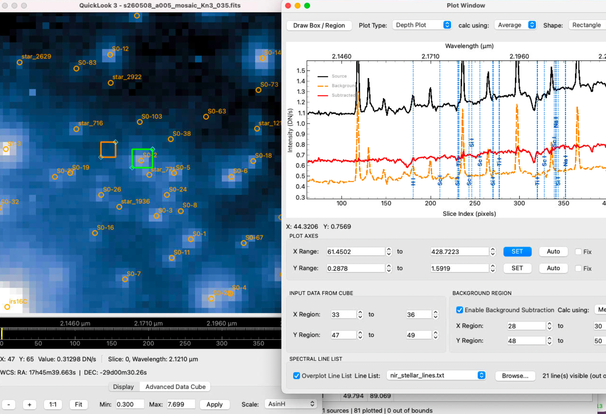
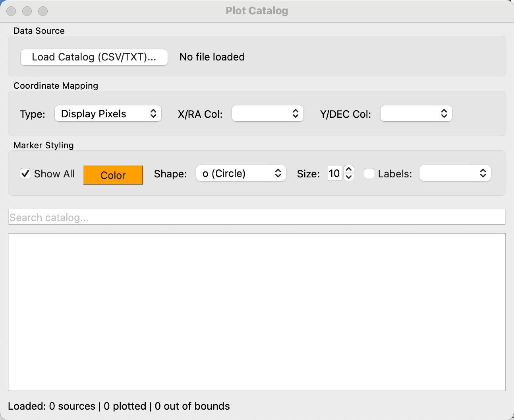

# Astronomical Tools & Algorithms Guide

QuickLook 3 provides a suite of analytical tools tailored for Integral Field Unit (IFU) data cubes and 2D astronomical images. This guide details the usage and mathematical algorithms underlying each tool.

---

## 1. Depth Plot & Spectral Line Lists

The **Depth Plot** tool extracts 1D spectra along the wavelength ($Z$) axis of a 3D data cube.



### Algorithms

#### A. Spatial Region Spectrum Extraction
For a user-selected Region of Interest (ROI) containing spatial pixels $(x, y)$, the spectrum value $S(z)$ at wavelength channel $z$ is computed using one of three calculation methods:

* **Mean (Average)**:
  $$S(z) = \frac{1}{N} \sum_{(x,y) \in \text{ROI}} I(x, y, z)$$
* **Median**:
  $$S(z) = \text{median}_{(x,y) \in \text{ROI}} \left( I(x, y, z) \right)$$
* **Total (Sum)**:
  $$S(z) = \sum_{(x,y) \in \text{ROI}} I(x, y, z)$$

#### B. Background Subtraction
When **Enable Background Subtraction** is checked, a secondary background ROI is defined. The background spectrum $S_{\text{bg}}(z)$ is calculated using the selected background method (Median, Mean, or Total), and the background-subtracted spectrum is computed as:

$$S_{\text{subtracted}}(z) = S_{\text{signal}}(z) - S_{\text{bg}}(z)$$

#### C. Wavelength Primary X-Axis & Dual Axis Display
When FITS WCS wavelength information is available, the primary bottom X-axis displays physical wavelengths $\lambda$ ($\mu\text{m}$). The top X-axis (`PixelIndexAxis`) dynamically renders the corresponding 0-indexed channel slice numbers ($z \in [0, N-1]$). 

This setup allows users to click the **Export...** button on the top control bar (or right-click the plot and select **Export...**) to save wavelength-resolved spectra ($xData = \lambda$, $yData = \text{Intensity}$) to CSV, vector graphics, or images.

Line list wavelengths $\lambda$ are mapped directly onto the plot in wavelength units. Overlays positioned outside the dataset's visible spectral range are automatically filtered out.

#### D. Spectral Line Overlay & Staggering
- Overlaid spectral line labels feature 90° vertical rotation.
- To prevent overlapping labels when spectral lines are closely spaced, label heights are automatically staggered across 4 discrete vertical offset levels.
- LaTeX mathematical expressions enclosed in `$$...$$` (e.g. `$$H_\alpha$$`, `$$P_{2f}6.5$$`) are automatically parsed and formatted.

#### E. Exporting Spectra & Figures (CSV, PNG, SVG)

Astronomers can export the extracted 1D spectra and plot graphics by clicking the **Export...** button on the top control bar (or right-clicking anywhere on the plot canvas and selecting **Export...**):

1. **Exporting Wavelength & Intensity Data to CSV**:
   - In the Export dialog, select **CSV Exporter** under **Item to export**.
   - Select the target curve (`PlotItem`, `Source`, `Background`, or `Subtracted`).
   - Click **Export** to save a `.csv` data table. When WCS is present, the first column contains physical wavelengths ($\mu\text{m}$) and subsequent columns contain corresponding flux/intensity values ($DN$ or $DN/s$).

2. **Exporting High-Resolution Images (PNG, JPG)**:
   - Select **Image Exporter** in the Export dialog.
   - Specify output image pixel dimensions ($W \times H$).
   - Click **Export** to save publication-quality plot figures.

3. **Exporting Vector Graphics (SVG)**:
   - Select **SVG Exporter** for vector graphics suitable for publication figures and vector editing software (e.g., Inkscape, Illustrator).

---

## 2. Spatial Profile Cuts

The **Cut Plot** tool extracts 1D spatial intensity profiles across slices of the image plane.

### Cut Types
* **Horizontal Cut**: A slice across a fixed $Y$ pixel coordinate range.
* **Vertical Cut**: A slice across a fixed $X$ pixel coordinate range.
* **Diagonal Cut**: An arbitrary linear cut defined by two endpoints $(x_0, y_0)$ and $(x_1, y_1)$.

### Algorithm
For multi-pixel cut widths, intensity values perpendicular to the cut vector are averaged or collapsed using Median, Mean, or Total sum.

---

## 3. 2D Peak & Line Fitting

The **Peak Fit** tool fits analytical 2D spatial surface models to stars, emission lines, or compact sources within a selected ROI.

### Mathematical Models

#### A. 2D Elliptical Gaussian
$$f(x, y) = z_0 + A \exp\left( -\left[ a (x - x_0)^2 + 2b (x - x_0)(y - y_0) + c (y - y_0)^2 \right] \right)$$

where:
$$a = \frac{\cos^2\theta}{2\sigma_x^2} + \frac{\sin^2\theta}{2\sigma_y^2}$$

$$b = -\frac{\sin 2\theta}{4\sigma_x^2} + \frac{\sin 2\theta}{4\sigma_y^2}$$

$$c = \frac{\sin^2\theta}{2\sigma_x^2} + \frac{\cos^2\theta}{2\sigma_y^2}$$

The Full-Width at Half-Maximum (FWHM) along major and minor axes is given by:
$$\text{FWHM}_x = 2 \sqrt{2 \ln 2} \cdot \sigma_x \approx 2.35482 \cdot \sigma_x$$
$$\text{FWHM}_y = 2 \sqrt{2 \ln 2} \cdot \sigma_y \approx 2.35482 \cdot \sigma_y$$

#### B. 2D Lorentzian
$$f(x, y) = z_0 + \frac{A}{1 + \left(\frac{x_{\text{rot}}}{\gamma_x}\right)^2 + \left(\frac{y_{\text{rot}}}{\gamma_y}\right)^2}$$

#### C. 2D Moffat Profile
$$f(x, y) = z_0 + A \left[ 1 + \left(\frac{x_{\text{rot}}}{\alpha_x}\right)^2 + \left(\frac{y_{\text{rot}}}{\alpha_y}\right)^2 \right]^{-\beta}$$

### Optimization
Fits are computed using non-linear Levenberg-Marquardt least-squares optimization (`scipy.optimize.curve_fit`).

---

## 4. Aperture Photometry

The **Aperture Photometry** tool computes integrated stellar fluxes and background sky noise.

### Algorithm
1. **Aperture Flux ($F_{\text{raw}}$)**: Sum of pixel intensities inside a circular aperture of radius $r_{\text{ap}}$.
2. **Sky Background ($I_{\text{sky}}$)**: Median pixel intensity computed inside an annular sky region between inner radius $r_{\text{in}}$ and outer radius $r_{\text{out}}$.
3. **Net Subtracted Flux ($F_{\text{net}}$)**:
   $$F_{\text{net}} = F_{\text{raw}} - \pi r_{\text{ap}}^2 \times I_{\text{sky}}$$

---

## 5. Strehl Ratio & Optical PSF Analysis

The **Strehl Ratio** tool evaluates Adaptive Optics (AO) performance by comparing the observed stellar Point Spread Function (PSF) against an ideal, diffraction-limited Airy pattern for a telescope of diameter $D$ at wavelength $\lambda$.

### Mathematical Model
The theoretical diffraction-limited Airy intensity pattern $I(\theta)$ is:

$$I(\theta) = I_0 \left( \frac{2 J_1(\pi D \theta / \lambda)}{\pi D \theta / \lambda} \right)^2$$

where $J_1(x)$ is the Bessel function of the first kind of order 1.

### Strehl Ratio Definition
$$\text{Strehl} = \frac{\left( \frac{I_{\text{peak}}}{F_{\text{total}}} \right)_{\text{observed}}}{\left( \frac{I_{\text{peak}}}{F_{\text{total}}} \right)_{\text{theoretical}}}$$

---

## 6. Datacube Arithmetic

The **Datacube Arithmetic** tool performs element-wise scalar or cube-to-cube mathematical operations ($+$, $-$, $\times$, $\div$) between open datasets:

$$D_{\text{result}}(x, y, z) = D_1(x, y, z) \odot D_2(x, y, z)$$

---

## 7. Catalog Plotting & World Coordinate Overlay

The **Plot Catalog** tool overlays external astronomical source catalogs directly onto the 2D image plane or collapsed datacube slices. Both text tables (CSV, TXT, DAT, ECSV, IPAC, ...) and FITS tables (`.fits`, `.fit`, `.fts`, and gzipped variants) are read.



### Input Formats

Text catalogs are parsed by `astropy.io.ascii` in guess mode, so most delimited or
fixed-width layouts load without configuration.

For a **FITS table**, any binary (`BINTABLE`) or ASCII (`TABLE`) extension can be used:

- When the file holds more than one table extension, the tool asks which one to read; a
  file with a single table loads without prompting. Tile-compressed image extensions are
  not offered, even though FITS stores them as binary tables.
- Columns holding one value *per row per element* — a spectrum column, for instance — are
  omitted, since a catalog overlay needs one scalar per source. The extension label next to
  the filename reports how many were skipped.
- Undefined (`TNULL`) and masked coordinates are counted as unusable in the status line
  rather than being plotted at the origin.
- Coordinate columns are guessed from the usual `photutils` and SExtractor spellings
  (`xcentroid`/`ycentroid`, `X_IMAGE`/`Y_IMAGE`, `ALPHA_J2000`/`DELTA_J2000`, `RAJ2000`,
  ...) in addition to plain `X`/`Y` and `RA`/`DEC`, and can always be overridden with the
  column selectors.

On the command line, `--catalog <file>` loads a catalog at startup and `--catalog-hdu
<index|EXTNAME>` selects the FITS extension non-interactively.

### Features & Coordinate Modes

Astronomers can select between three coordinate modes:

1. **World Coordinates (RA / DEC)**: Celestial Right Ascension ($\text{RA}$) and Declination ($\text{DEC}$) in degrees or sexagesimal notation.
2. **FITS Array Pixels**: 0-indexed or 1-indexed raw FITS array pixel coordinates $(x_{\text{fits}}, y_{\text{fits}})$.
3. **Display Pixels**: Direct display viewport pixel coordinates.

### Algorithms

#### A. WCS Celestial-to-Pixel Transformation
For catalogs specified in celestial World Coordinates $(\text{RA}, \text{DEC})$, celestial coordinates are converted to raw FITS pixel coordinates $(x_{\text{fits}}, y_{\text{fits}})$ using the dataset's 2D/3D FITS World Coordinate System:

$$(x_{\text{fits}}, y_{\text{fits}}) = \text{WCS}^{-1}(\text{RA}, \text{DEC})$$

#### B. Display Rotation & Flip Mapping
To ensure source overlays track the image viewport when the astronomer rotates or flips the view, original FITS coordinates $(x_0, y_0)$ are mapped to current display coordinates $(x_{\text{disp}}, y_{\text{disp}})$ via the transformation algorithm:

1. **Horizontal Flip Adjustment**:
   If horizontal flipping is enabled:
   $$x_1 = N_x - 1 - x_0, \quad y_1 = y_0$$

2. **90° Rotation Iterations**:
   For $k = \frac{\theta}{90^\circ}$ orthogonal rotations:
   $$(x_{i+1}, y_{i+1}) = (N_{y,i} - 1 - y_i, \; x_i)$$

#### C. Interactive Highlighting & Filtering
- **Interactive Source Selection**: Clicking any row in the catalog table highlights the target object on the image display with a target reticle ring, and recentres the view on it.
- **Clearing a selection**: press **Escape** in the table, use the **Clear Selection** button beside the search box, or pick **Clear Selection** from the row's right-click menu. The view stays where it is. (Qt's own way out of a single-selection table is ctrl-clicking the selected row, which few people find.)
- **Search & Filter**: Real-time text search filters the catalog table and dynamically updates plotted markers.
- **Custom Marker Styling**: Supports customizable marker shapes (Circles, Squares, Triangles, Diamonds, Crosses), sizes, colors, and text labels.

---

## 8. FITS Header Editor

The **Header Editor** allows astronomers to view, search, add, or modify FITS header cards across all HDU extensions in memory. Changes can be saved back to a new FITS file.

---

## 9. Regions

Regions are annotations drawn over the image — **circles, boxes, arrows and text** — in the manner
of ds9. They can be saved and reloaded, exchanged with ds9 as `.reg` files, and handed to the
Catalog tool.

Everything lives under the **Region** menu; the same tools are available from a small vertical
toolbar (**Region ➔ Region Toolbar**, off by default and remembered once chosen) and from the
image's own right-click menu.

### Drawing

| Shape | How |
|-------|-----|
| Circle | drag out from the centre |
| Box | drag between opposite corners |
| Arrow | drag from tail to head |
| Text | click where the label goes; the label is asked for afterwards |

Right-clicking the image offers **New Region ➔ Circle / Box / Arrow / Text**, which places a
**default-sized** region on the pixel under the cursor without any dragging — usually quicker, since
the size is easy to change afterwards.

A region is moved by dragging it and resized from its handles. A **text** region has no separate
marker: the text itself is the handle, so click, drag or right-click the words.

### Editing

**Double-click a region** — or choose **Properties…** from its right-click menu, or from the Region
List — to open an editor for everything it carries: position and size, angle, label, colour, line
width, dashing, text size, tag, visibility, and a channel range.

A **channel range** restricts a region to part of a cube, so a marker on an emission-line feature
appears only across the channels where the feature is. This has no equivalent in ds9 and is dropped
when exporting a `.reg` file, which the export report says.

**Region ➔ Region List…** shows every region in a table — type, position, size, angle, label, colour
and visibility — editable in place. Double-click the *Colour* cell for a colour picker, or the
*Type* cell for the full properties dialog. Right-click a row for **Properties…**, **Zoom To**,
**Colour…**, **Copy Coordinates** and **Delete** — *Zoom To* is the way to find one region in a
crowded field.

### Colours

Regions default to ds9's green. Note that this is the neon `#00ff00` ds9 draws, not the dark
`#008000` that Qt and the SVG palette call "green": colour *names* are kept in the model and in
saved files so they stay idiomatic, and are resolved to ds9's own RGB only for drawing.

### Labels in a crowded field

A region's `text` is drawn beside it. With a large catalogue that becomes a great deal of text, so:

- only labels inside the visible area are drawn — zoom in and more appear;
- labels are hidden while the view is panning and return once it settles;
- **Region ➔ Show Region Labels** turns them off entirely, as the Catalog tool's *Show Names* does.

### Saving, loading and ds9

| Action | Format |
|--------|--------|
| **Load Regions…** | either format — the file's *contents* decide, so a ds9 file named `.yml` still loads |
| **Save Regions As…** | QuickLook 3 YAML, unless the name ends in `.reg` |
| **Export ds9 Regions…** | ds9 `.reg`, whatever the name |

The native format is readable YAML that can be edited by hand:

```yaml
format: pyql3-regions/1
written_by: QuickLook 3 v3.0.19
regions:
- type: circle
  x: 31.5
  y: 9.5
  radius: 4.0
  text: src A
  z_range: [120, 180]
```

Geometry is stored in **pixels**, with the sky position recorded alongside when the file has a WCS,
so a region stays where it was drawn and still means something on another frame of the same field.

ds9 export writes sky coordinates automatically when image coordinates would not line up — ds9's
`image` frame always means FITS axes 1 and 2, while an OSIRIS cube is displayed on axes 3 and 2.
Anything that cannot be carried across, in either direction, is listed in a summary rather than
dropped in silence.

`--regions FILE` loads a region file at startup, in either format.

### Very large sets

Above 500 regions the whole set is drawn as a single overlay instead of one item each: 20,000
regions then load in about two seconds and 150 MB, against roughly two minutes and 1.2 GB. The
trade is that individual regions can no longer be dragged or right-clicked — they are still listed,
edited, saved and exported. The status bar says when this happens.

For a large set, **Region ➔ Send Regions to Plot Catalog…** copies them into the
[Catalog tool](#7-catalog-plotting--world-coordinate-overlay), which has a sortable table, a search
box and row highlighting. It is a copy taken at that moment, not a live link.
