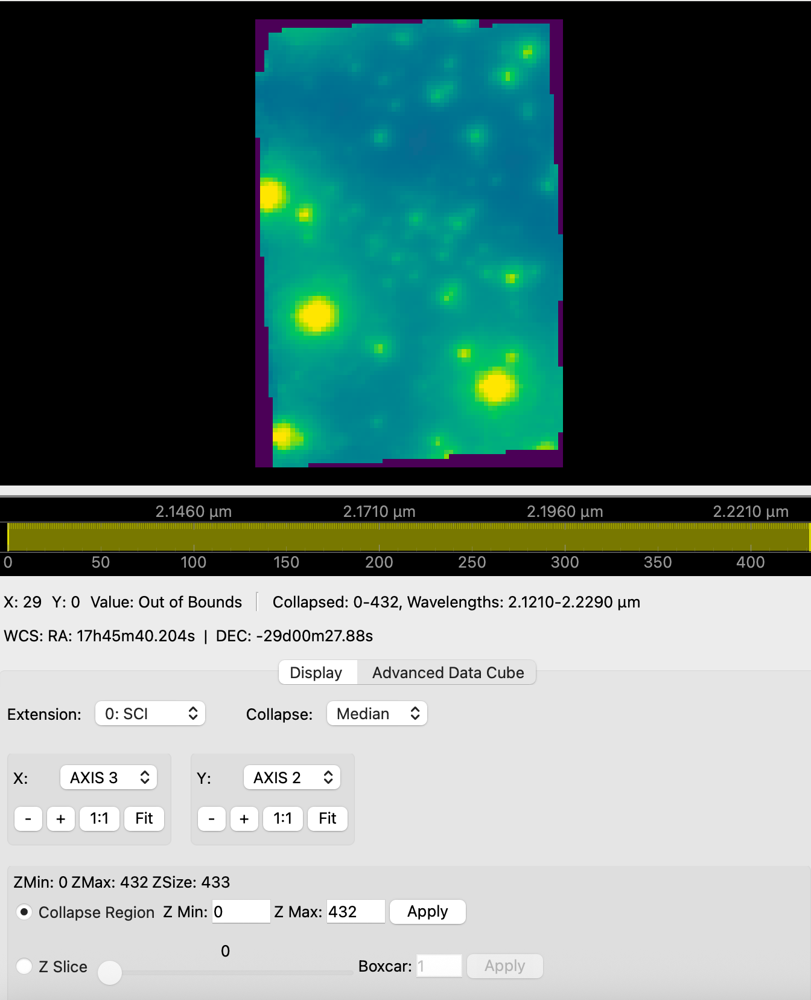

# Astronomical Tools & Algorithms Guide

QuickLook 3 provides a suite of analytical tools tailored for Integral Field Unit (IFU) data cubes and 2D astronomical images. This guide details the usage and mathematical algorithms underlying each tool.

---

## 1. Depth Plot & Spectral Line Lists

The **Depth Plot** tool extracts 1D spectra along the wavelength ($Z$) axis of a 3D data cube.

### Algorithms

#### A. Spatial Region Spectrum Extraction
For a user-selected Region of Interest (ROI) containing spatial pixels $(x, y)$, the spectrum value $S(z)$ at wavelength channel $z$ is computed using one of three calculation methods:

* **Mean (Average)**:
  $$S(z) = \frac{1}{N} \sum_{(x,y) \in \text{ROI}} I(x, y, z)$$
* **Median**:
  $$S(z) = \text{median}_{(x,y) \in \text{ROI}} \left( I(x, y, z) \right)$$
* **Total (Sum)**:
  $$S(z) = \sum_{(x,y) \in \text{ROI}} I(x, y, z)$$

#### B. Background Subtraction
When **Enable Background Subtraction** is checked, a secondary background ROI is defined. The background spectrum $S_{\text{bg}}(z)$ is calculated using the selected background method (Median, Mean, or Total), and the background-subtracted spectrum is computed as:

$$S_{\text{subtracted}}(z) = S_{\text{signal}}(z) - S_{\text{bg}}(z)$$

#### C. WCS Wavelength to Pixel Mapping
Line list wavelengths $\lambda$ (in $\mu\text{m}$, $\text{nm}$, or $\text{\AA}$) are converted to 0-indexed spectral channel indices $z$ using the FITS World Coordinate System (WCS):

$$z = \text{WCS}^{-1}(\lambda)$$

Line overlays positioned outside the dataset's spectral wavelength range $[z_{\min}, z_{\max}]$ are automatically filtered out.

#### D. Spectral Line Overlay & Staggering
- Overlaid spectral line labels feature 90° vertical rotation.
- To prevent overlapping labels when spectral lines are closely spaced, label heights are automatically staggered across 4 discrete vertical offset levels.
- LaTeX mathematical expressions enclosed in `$$...$$` (e.g. `$$H_\alpha$$`, `$$P_{2f}6.5$$`) are automatically parsed and formatted.

---

## 2. Spatial Profile Cuts

The **Cut Plot** tool extracts 1D spatial intensity profiles across slices of the image plane.

### Cut Types
* **Horizontal Cut**: A slice across a fixed $Y$ pixel coordinate range.
* **Vertical Cut**: A slice across a fixed $X$ pixel coordinate range.
* **Diagonal Cut**: An arbitrary linear cut defined by two endpoints $(x_0, y_0)$ and $(x_1, y_1)$.

### Algorithm
For multi-pixel cut widths, intensity values perpendicular to the cut vector are averaged or collapsed using Median, Mean, or Total sum.

---

## 3. 2D Peak & Line Fitting

The **Peak Fit** tool fits analytical 2D spatial surface models to stars, emission lines, or compact sources within a selected ROI.

### Mathematical Models

#### A. 2D Elliptical Gaussian
$$f(x, y) = z_0 + A \exp\left( -\left[ a (x - x_0)^2 + 2b (x - x_0)(y - y_0) + c (y - y_0)^2 \right] \right)$$

where:
$$a = \frac{\cos^2\theta}{2\sigma_x^2} + \frac{\sin^2\theta}{2\sigma_y^2}$$

$$b = -\frac{\sin 2\theta}{4\sigma_x^2} + \frac{\sin 2\theta}{4\sigma_y^2}$$

$$c = \frac{\sin^2\theta}{2\sigma_x^2} + \frac{\cos^2\theta}{2\sigma_y^2}$$

The Full-Width at Half-Maximum (FWHM) along major and minor axes is given by:
$$\text{FWHM}_x = 2 \sqrt{2 \ln 2} \cdot \sigma_x \approx 2.35482 \cdot \sigma_x$$
$$\text{FWHM}_y = 2 \sqrt{2 \ln 2} \cdot \sigma_y \approx 2.35482 \cdot \sigma_y$$

#### B. 2D Lorentzian
$$f(x, y) = z_0 + \frac{A}{1 + \left(\frac{x_{\text{rot}}}{\gamma_x}\right)^2 + \left(\frac{y_{\text{rot}}}{\gamma_y}\right)^2}$$

#### C. 2D Moffat Profile
$$f(x, y) = z_0 + A \left[ 1 + \left(\frac{x_{\text{rot}}}{\alpha_x}\right)^2 + \left(\frac{y_{\text{rot}}}{\alpha_y}\right)^2 \right]^{-\beta}$$

### Optimization
Fits are computed using non-linear Levenberg-Marquardt least-squares optimization (`scipy.optimize.curve_fit`).

---

## 4. Aperture Photometry

The **Aperture Photometry** tool computes integrated stellar fluxes and background sky noise.

### Algorithm
1. **Aperture Flux ($F_{\text{raw}}$)**: Sum of pixel intensities inside a circular aperture of radius $r_{\text{ap}}$.
2. **Sky Background ($I_{\text{sky}}$)**: Median pixel intensity computed inside an annular sky region between inner radius $r_{\text{in}}$ and outer radius $r_{\text{out}}$.
3. **Net Subtracted Flux ($F_{\text{net}}$)**:
   $$F_{\text{net}} = F_{\text{raw}} - \pi r_{\text{ap}}^2 \times I_{\text{sky}}$$

---

## 5. Strehl Ratio & Optical PSF Analysis

The **Strehl Ratio** tool evaluates Adaptive Optics (AO) performance by comparing the observed stellar Point Spread Function (PSF) against an ideal, diffraction-limited Airy pattern for a telescope of diameter $D$ at wavelength $\lambda$.

### Mathematical Model
The theoretical diffraction-limited Airy intensity pattern $I(\theta)$ is:

$$I(\theta) = I_0 \left( \frac{2 J_1(\pi D \theta / \lambda)}{\pi D \theta / \lambda} \right)^2$$

where $J_1(x)$ is the Bessel function of the first kind of order 1.

### Strehl Ratio Definition
$$\text{Strehl} = \frac{\left( \frac{I_{\text{peak}}}{F_{\text{total}}} \right)_{\text{observed}}}{\left( \frac{I_{\text{peak}}}{F_{\text{total}}} \right)_{\text{theoretical}}}$$

---

## 6. Datacube Arithmetic

The **Datacube Arithmetic** tool performs element-wise scalar or cube-to-cube mathematical operations ($+$, $-$, $\times$, $\div$) between open datasets:

$$D_{\text{result}}(x, y, z) = D_1(x, y, z) \odot D_2(x, y, z)$$

---

## 7. FITS Header Editor

The **Header Editor** allows astronomers to view, search, add, or modify FITS header cards across all HDU extensions in memory. Changes can be saved back to a new FITS file.
